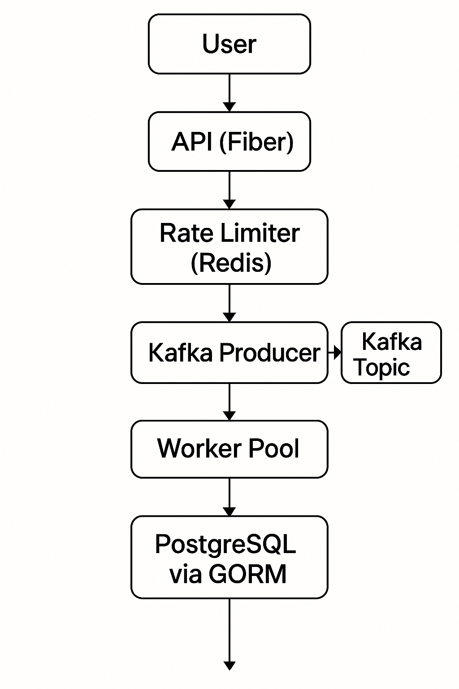

# 💸 Go Financial Transactions

> Sistema de transações financeiras assíncronas e escaláveis com Go, Kafka, PostgreSQL e Redis.



[](https://golang.org/)
[](https://github.com/gabrielksneiva/go-financial-transactions/actions)
[](#)
[](LICENSE)

---

## 🧠 Sobre o Projeto

Este projeto simula um sistema de transações financeiras, projetado para ser altamente performático, assíncrono e escalável, ideal para aplicações bancárias, carteiras digitais e processadores de pagamento. Ele demonstra:

- Comunicação assíncrona via **Apache Kafka**
- Processamento concorrente com **workers Go**
- Controle de limite de requisições com **Redis Rate Limiter**
- Armazenamento e consistência com **PostgreSQL + GORM**
- Autenticação via **JWT**
- Testes com cobertura > 85%
- CI/CD com **GitHub Actions**

---

## 🧩 Arquitetura

A arquitetura segue o padrão Clean Architecture com camadas desacopladas e testáveis.

```plaintext
            +------------+
            |  API (Fiber)
            +------+-----+
                   |
                   v
         +---------+----------+
         | Services (Business)|
         +---------+----------+
                   |
         +---------+----------+
         |    Repositories    |
         +----+----------+----+
              |          |
        +-----+      +---+---------+
        |Kafka|      | PostgreSQL  |
        +-----+      +-------------+
```

O Kafka atua como middleware entre as requisições HTTP e os workers. Workers processam as mensagens assincronamente, atualizando os saldos no banco de dados.

---

## 🛠️ Tecnologias

- [Go 1.21](https://golang.org/)
- [Apache Kafka](https://kafka.apache.org/)
- [Fiber](https://gofiber.io/)
- [PostgreSQL](https://www.postgresql.org/)
- [Redis](https://redis.io/)
- [GORM](https://gorm.io/)
- [JWT](https://github.com/golang-jwt/jwt)
- [sqlmock](https://github.com/DATA-DOG/go-sqlmock)
- [GitHub Actions](https://github.com/features/actions)

---

## 🚀 Como Rodar

### Pré-requisitos

- Docker + Docker Compose
- Go 1.21+

```bash
# Clone o projeto
git clone https://github.com/gabrielksneiva/go-financial-transactions.git
cd go-financial-transactions

# Suba os serviços (Kafka, Redis, PostgreSQL)
docker-compose up -d

# Rode a aplicação
go run main.go
```

---

## 🧪 Testes

```bash
# Executar todos os testes unitários
go test ./... -coverprofile=coverage.out

# Ver cobertura
go tool cover -func=coverage.out
```

✅ Testes de unidades cobrindo: services, API handlers, middleware, workers, repositories, Kafka producer e consumer.

---

## 📁 Estrutura do Projeto

```bash
.
├── api/               # Handlers, rotas e inicialização HTTP (Fiber)
├── config/            # Configuração da aplicação
├── consumer/          # Kafka consumer
├── producer/          # Kafka producer
├── domain/            # Entidades e interfaces
├── services/          # Lógica de negócio
├── workers/           # Workers paralelos
├── repositories/      # Integração com banco de dados
├── mocks/             # Mocks para testes
├── main.go            # Entry point
├── go.mod / go.sum    # Dependências
└── README.md          # Documentação do projeto
```

---

## 🧠 Conceitos Demonstrados

- Go routines, canais e `context.Context`
- Injeção de dependência
- Testes com `sqlmock` e `testify`
- Arquitetura orientada a mensagens
- Pipeline CI/CD com GitHub Actions
- Rate Limiting baseado em Redis TTL
- Modularização e clean code

---

## 🎯 Próximos Passos

- [ ] Swagger para documentação de endpoints
- [ ] Integração com Fireblocks API
- [ ] Deploy automatizado via Docker + Render ou Railway
- [ ] Observabilidade com Prometheus + Grafana

---

## 👨‍💻 Autor

**Gabriel Kryzanovski dos Santos Neiva**  
[GitHub](https://github.com/gabrielksneiva) | [LinkedIn](https://linkedin.com/in/gabrielksneiva)

---

## 📄 Licença

Distribuído sob a licença MIT. Veja [`LICENSE`](LICENSE) para mais detalhes.